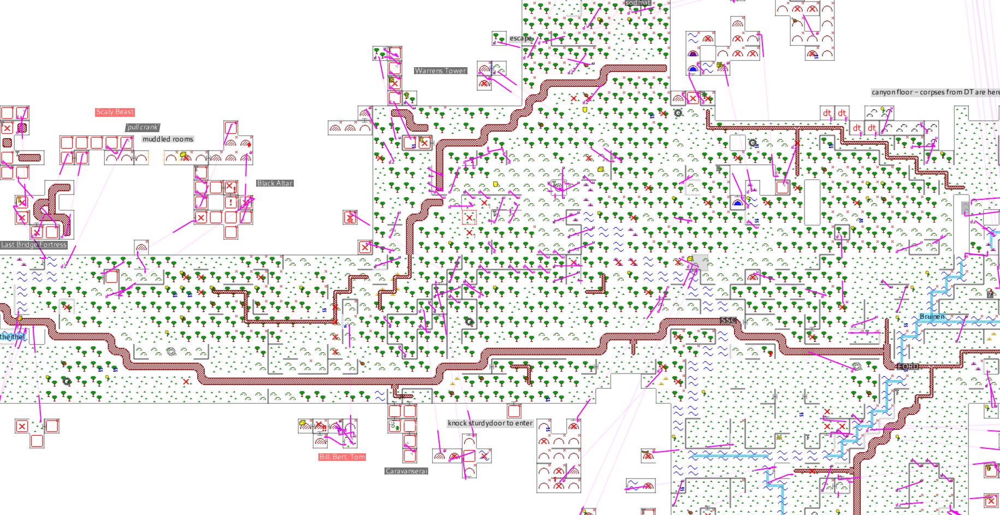
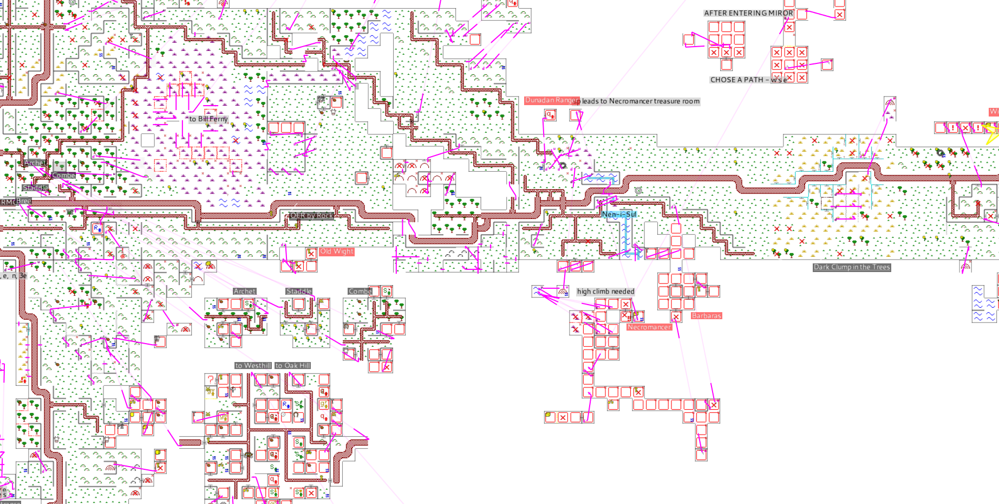
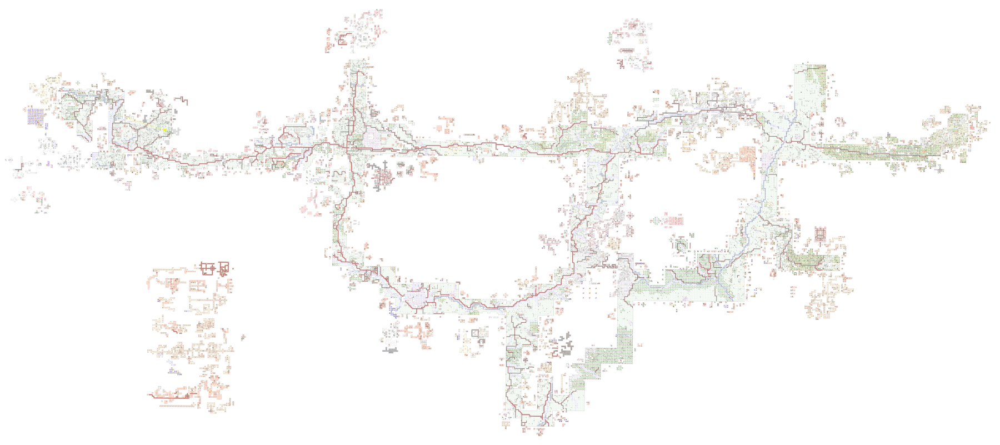

Gefe/Rik MMapper Tileset
========================

An MMapper tileset based on Gefe and Rik's classic MUME maps.





## Setup
- See https://github.com/MUME/MMapper/wiki/Modding for where to put the pixmaps/ folder.
- Check the options/ folder for alternative versions of certain tiles.
- Set your background to white (#ffffff) and connections to magenta (#ff00ff).
- You might also want to set dark/light w/o sundeath colors to be lighter.

## Notes
- The original maps have a tile size of 16x16 with a safe area of 2px on all sides for a total of 20x20 per tile. To avoid blurry filtering, the tiles have been scaled up proportionally to 128x128 (160x160 with the safe area).
- Some custom tiles needed to be made to support all terrain types and get mobs/shops to match the style. These are listed in the options/ folder along with alternatives.

```
TODO
- There are still flags like food and herblore to be replaced with versions that match the style.
- Path-based streams from the original maps could replace the default MMapper stream tiles.
```

## Credits
- Gefe and Rik's maps, available from http://mume.kyrania.com/.
- Eolo is also credited on an older version of the Misty Mountains & Anduin Vale map I have.
- Sample screenshots were taken using Faine's map.

-Octavia
